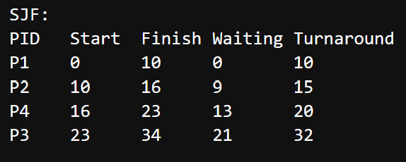
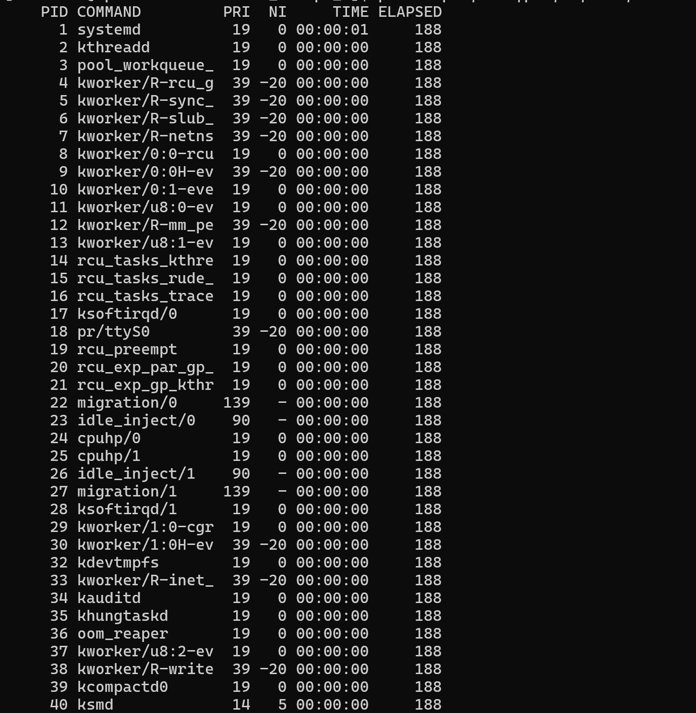
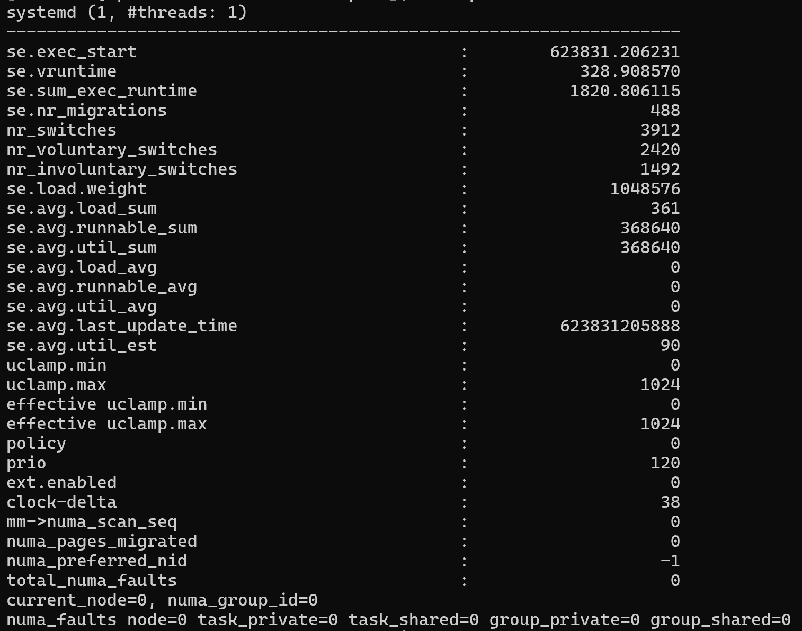

# OS Group Project - Scheduling Algorithms

This repository contains Python implementations of CPU scheduling algorithms:
- SJF (Shortest Job First)
- SRTF (Shortest Remaining Time First)
- FCFS (First Come First Serve)
- Round Robin (RR)
- Priority Scheduling (PS)

It also includes Linux integration script which fetches real data from Linux for comparisons between theoretical and CFS algorithms. This was performed by using AWS EC2 instance.

## How to Run the Python Codes
1. Clone the repository:
   git clone https://github.com/dimasputra7/os_project_scheduling_algorithms.git
2. Install dependencies:
   pip install -r requirements.txt
3. Run any python script:
   python SJF.py
4. If needed, modify the values in the *sample_processes* then run all the cells to see the results

## Example Python Code Outputs:

## Linux Integration Environment
- **OS:** Ubuntu 22.04 LTS
- **Kernel:** 5.10 (or newer)
- **Python:** 3.10
- **Access Method:** SSH to AWS EC2 instance

## Running Linux Integration Scripts
1. Connect to AWS instance via SSH:
   ssh -i "your_key.pem" ubuntu@ec2-ip-address
2. Navigate to the project folder:
   cd ~/scheduling_algorithms
3. Run the Linux integration script 1:
   
   Script: ps -eo pid,comm,pri,ni,time,etimes
   
   Collected data: PID
   
   Explanation:
   - *ps* = Process status (shows active processes on the system)
   - *-e* = List all processes
   - *pid* = Process ID (unique process indetifier)
   - *comm* = Command name (the name of executable or process)
   - *pri* = Priority (the kernel's scheduling priority, lower number is higher priority)
   - *ni* = Nice value (Adjustable priority, lower number is higher priority)
   - *time* = CPU time used by the process
   - *etimes* = Elapsed time (the duration of the process has been running)
   
5. Run the Linux integration script 2:
   Script: cat proc/*pid*/sched
   
   Note: change *pid* with any PID numbers from script 1

   Collected data: PID, vruntime, sum_exec_runtime, nr_voluntary_switches, nr_involuntary_switches, load.weight, policy

   Explanation:
   - *cat* = Display all the contents of a file
   - */proc* = A virtual filesystem (contains all the information of every running process)
   - *pid* = Process ID (unique process identifier)
   - *sched* = Scheduler statistics
     
7. The data were chosen and collected manually for analysis and visualization purposes
   
## Example Linux Integration Outputs:
Script 1:

Script 2:

